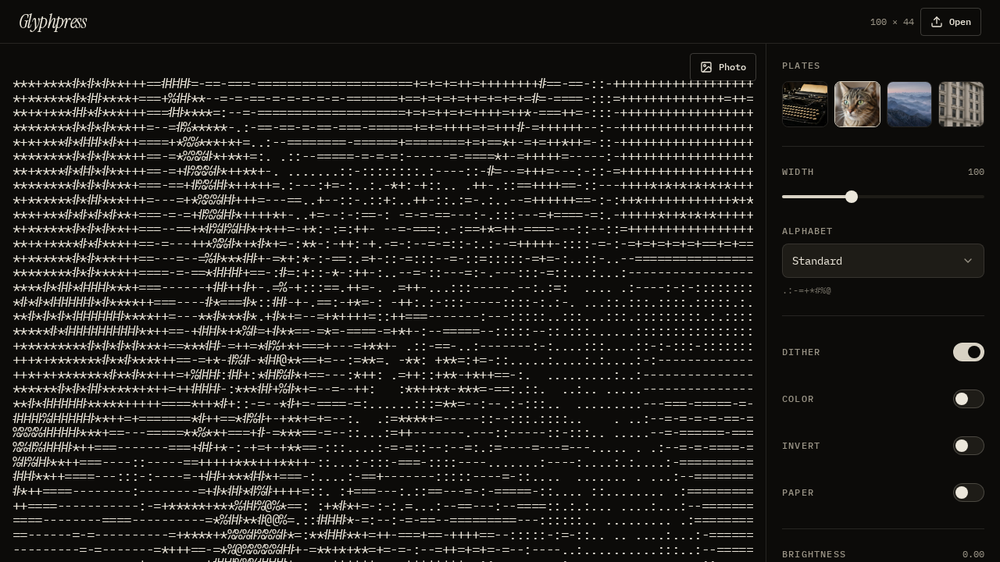
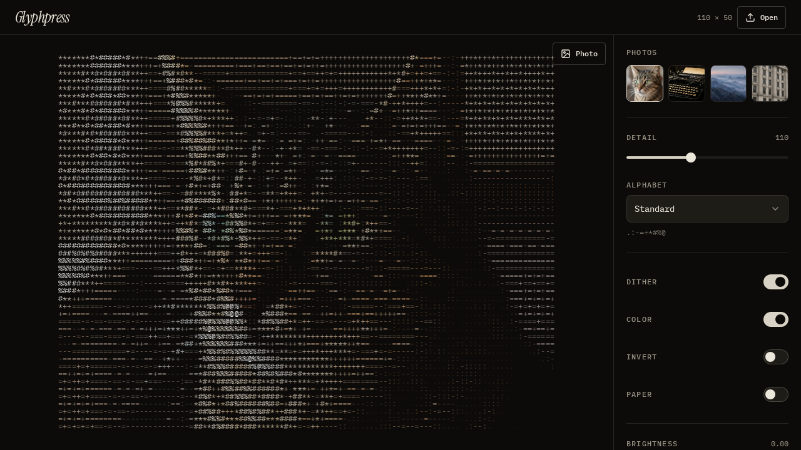
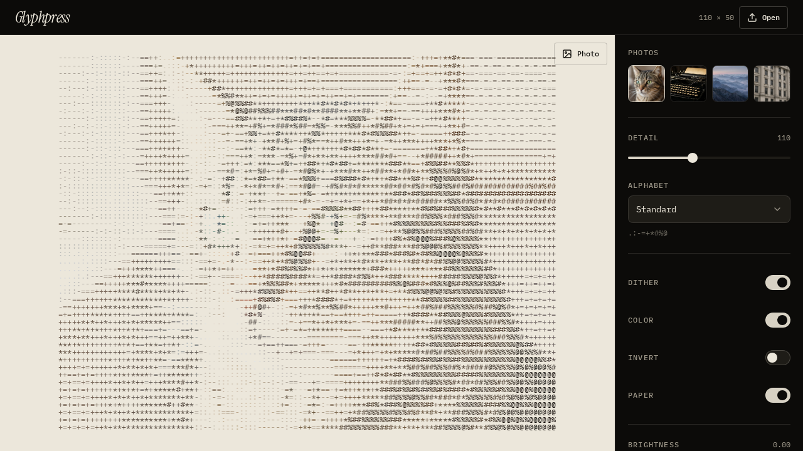

# Glyphpress

Turn any image into ASCII art in your browser. Nothing is uploaded, all conversion happens on your device.



## Features

- Drop, paste or pick an image, or try one of the built in samples
- 9 character sets: Standard, Dense, Braille, Blocks, Simple, Binary, Dots, Hash, and your own custom set
- Adjustable width, brightness and contrast
- Dithering, invert, and colour output
- Paper mode for a printed look
- Copy as text, copy as image, download as .txt or .png
- Settings are remembered between visits

| Colour | Paper |
| --- | --- |
|  |  |

## Run it locally

You need Node.js 20 or newer.

```bash
npm install
npm run dev
```

Then open http://localhost:8080

## Built with

React 19, TanStack Start, Vite, Tailwind CSS 4 and Radix UI. The conversion logic lives in `src/lib/ascii.ts` and the interface in `src/components/glyphpress.tsx`.
